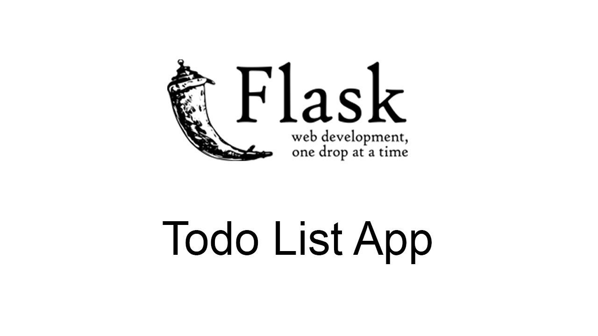

<!DOCTYPE html>
<html lang="en">
<head>
  <meta charset="utf-8">
  <title>Moses</title>
  <meta content="width=device-width, initial-scale=1.0" name="viewport">
  <meta content="" name="keywords">
  <meta content="" name="description">

  <!-- Favicons -->
  <link href="img/favicon.png" rel="icon">
  <link href="img/apple-touch-icon.png" rel="apple-touch-icon">

  <!-- Bootstrap CSS File -->
  <link href="lib/bootstrap/css/bootstrap.min.css" rel="stylesheet">

  <!-- Libraries CSS Files -->
  <link href="lib/font-awesome/css/font-awesome.min.css" rel="stylesheet">
  <link href="lib/animate/animate.min.css" rel="stylesheet">
  <link href="lib/ionicons/css/ionicons.min.css" rel="stylesheet">
  <link href="lib/owlcarousel/assets/owl.carousel.min.css" rel="stylesheet">
  <link href="lib/lightbox/css/lightbox.min.css" rel="stylesheet">

  <!-- Main Stylesheet File -->
  <link href="css/style.css" rel="stylesheet">
</head>

<body id="page-top">

  <!--/ Navbar Starts Here /-->
  <nav class="navbar navbar-b navbar-trans navbar-expand-md fixed-top" id="mainNav">
    

      <a class="navbar-brand js-scroll" href="#page-top">Moses</a>
      <button class="navbar-toggler collapsed" type="button" data-toggle="collapse" data-target="#navbarDefault"
        aria-controls="navbarDefault" aria-expanded="false" aria-label="Toggle navigation">
        
        
        
      </button>
      

        <ul class="navbar-nav">
          <li class="nav-item">
            <a class="nav-link js-scroll active" href="#home">Home</a>
          </li>
          <li class="nav-item">
            <a class="nav-link js-scroll" href="#about">About</a>
          </li>
          <li class="nav-item">
            <a class="nav-link js-scroll" href="#portfolio">Portfolio</a>
          </li>
          <li class="nav-item">
            <a class="nav-link js-scroll" href="#contact">Contact</a>
          </li>
        </ul>
      

    

  </nav>
  <!--/ Nav End /-->

  <!--/ Intro Skew Star /-->
  

    

    

      

        

          
Hello, world!

          <h1 class="intro-title mb-4">I am Moses Gbondo</h1>
          
Computer Science Graduate, Economics Graduate, Software Engineer, Web Developer,Data Analyst,Full-stack Developer<strong class="text-slider"></strong>

          <!-- 
<a class="btn btn-primary btn js-scroll px-4" href="#about" role="button">Learn More</a>
 -->
        

      

    

  

  <!--/ Intro Skew End /-->

  <section id="about" class="about-mf sect-pt4 route">
    

      

        

          

            

              

                

                  

                    

                      
                    

                  

                  

                    

                      
Name:  Moses Saffa Gbondo

                      
Profile:  Software Engineer

                      
Email:  gbondos@berea.edu

                      
Phone:  (862) 371-2759

                    

                  

                

                

                  
Knowledge Level

                  PROGRAMMING LANGUAGES - (Python, Java, C#) 80%
                  

                    

                  

                  CLOUD COMPUTING - (AWS, Azure, Google Cloud) 65%
                  

                    

                  

                  WEB FRAMEWORKS - (Django, Flask, Ruby, Spring) 70%
                  

                    

                  

                  DATABASES - (MySQL, PostgreSQL, MongoDB) 85%
                  

                    

                  

                

              

              

                

                  

                    <h5 class="title-left">
                      About Me
                    </h5>
                  

                  

                    Hello, World! My name is Moses and I am a Computer Science
                    and Economics graduate from Berea College, Berea, Kentucky.
                    I prefer Computer Science to Economics simply because
                    I love programming. I think programming is a beautiful piece of art
                    that can transform an abstract idea into a reality.                   

                  

                    With programming, I have been able to develop technologies that saves
                    people's time and money and increase their productivity. It is an amazing feeling
                    to make a positive difference in society.
                  

                  

                    Check out my Portfolio below!
                  

                

              

            

          

        

      

    

  </section>

<!-- - PORTFOLIO SECTION STARTS HERE------>
<section id="portfolio" class="about-mf sect-pt4 route">
  

    

      

        

          <h3 class="title-a">
            Portfolio
          </h3>
          

            Check out some of my projects.
          

          

        

      

    

    

    

    

    <button class="btn active" onclick="filterSelection('all')"> Show all</button>
    <button class="btn" onclick="filterSelection('applications')">Web Applications</button>
    <button class="btn" onclick="filterSelection('certificates')">Certifications</button>
    <button class="btn" onclick="filterSelection('youtube')"> Youtube Channel</button>
    

    

    <!-- Portfolio Gallery Grid -->

    

    

     

       
       <h4>My ToDo Flask App</h4>
       
Using Flask to illustrate CRUD operations

     

    

    

     

       
       <h4>Certifications</h4>
       
Find my learning certificates

     

    

    

     

       <!--  -->
       <iframe width="270" height="210" src="https://www.youtube.com/embed/IiD4XvWKi5g" frameborder="0" allow="accelerometer; autoplay; encrypted-media; gyroscope; picture-in-picture" allowfullscreen></iframe>
       <h4>Youtube Channel</h4>
       
Focuses on teaching coding 

     

    

    <!-- END GRID -->
    

    <!-- END MAIN -->
    

  

</section>
 <!-- ==================
 PORTFOLIO SECTION ENDS HERE
  ================== -->

  <!--/ Section Contact-Footer Star /-->
  <section class="paralax-mf footer-paralax bg-image sect-mt4 route" style="background-image: url(img/overlay-bg.jpg)">
    

    

      

        

          

            

              

                

                  

                    <h5 class="title-left">
                      Contact
                    </h5>
                  

                  

                    

                      Get in Touch with me.
                    

                    <ul class="list-ico">
                      <li> 101 Chestnut St Berea, KY 40403</li>
                      <li> (862) 371-2759</li>
                      <li>gbondos@berea.edu</li>
                    </ul>
                  

                  

                    <ul>
                      <li><a href="https://github.com/gbondos" target="_blank"><i class="ion-social-github"></i></a></li>
                      <li><a href="https://www.linkedin.com/in/moses-saffa-gbondo-22597570/" target="_blank"><i class="ion-social-linkedin"></i></a></li>
                      <li><a href="https://www.youtube.com/channel/UCCTGtIvsAUZ7J6e5ytem41g?view_as=subscriber" target="_blank"><i class="ion-social-youtube"></i></a></li>
                    </ul>
                  

                

              

            

          

        

      

    

    <footer>
      

        

          

            

              
&copy; Copyright <strong>Moses Saffa Gbondo</strong>. All Rights Reserved

            

          

        

      

    </footer>
  </section>
  <!--/ Section Contact-footer End /-->

  <a href="#" class="back-to-top"><i class="fa fa-chevron-up"></i></a>
  

  <!-- JavaScript Libraries -->
  
  
  
  
  
  
  
  
  
  
  <!-- Contact Form JavaScript File -->
  

  <!-- Template Main Javascript File -->
  
  

</body>
</html>
